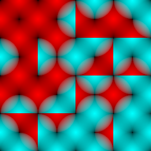
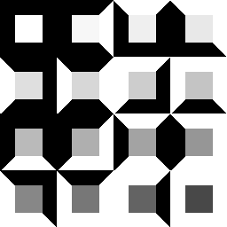

# Wang Tiles Grid generator


## Quick Start

The project is using [nobuild](https://github.com/tsoding/nobuild#nobuild) build system.

```console
$ cc -o nobuild nobuild.c
$ ./nobuild run
$ feh atlas.png
$ feh grid.png
```

## Goal

Trying to generate a random grid of 2-colored [Wang Tiles](http://www.cr31.co.uk/stagecast/wang/intro.html) based on a single function definition:

```c
typedef struct { float c[2]; } Vec2f;
typedef struct { float c[3]; } Vec3f;
typedef Vec2f UV;
typedef Vec3f RGB;
typedef uint8_t BLTR;

RGB wang(BLTR bltr, UV uv);
```

where

- `bltr` is a 4 bit mask encoding the specific Wang Tile. Each bit represents a side of the tile in the following order: Bottom, Left, Top, Right. `0` is the first color, `1` is the second one.
- `uv` is a 2D vector that represents a point on the tile. Top-Left corner is `[0.0, 0.0]`, Bottom-Right corner is `[1.0, 1.0]`. Coordinates are normalized and resolution-independant.
- The result of the function is a 3D vector that represents an RGB color of a pixel on the tile `bltr` at `uv`.

Think of it as a [Fragment Shader](https://www.khronos.org/opengl/wiki/Fragment_Shader) that generates a Texture for a Wang Tile based on its bitmask description.

## Phases

The whole rendering is split into roughly 3 phases and done entirely on CPU.

### Phase 1. Atlas Rendering

Given the "Shader" function described in the [Goal](#goal) section we generate an atlas (spritesheet) of all 16 Wang Tiles. (4 sides, 2 colors, 2⁴ = 16)

 

### Phase 2. Grid Generation

Given the size of the grid in tiles we generate 2D array of `BLTR`-s (defined in the [Goal](#goal) section) satisfying the Wang Tile constraints between the tiles (the adjacent side of the tiles must have the same color).

### Phase 3. Grid Rendering

<!-- TODO: grid rendering section -->

## Screencasts

The development was streamed on [Twitch](https://twitch.tv/tsoding). Here is an archive of screencasts: https://www.youtube.com/playlist?list=PLpM-Dvs8t0VYgJXZyQzWjfYUm3MxcvqR0
