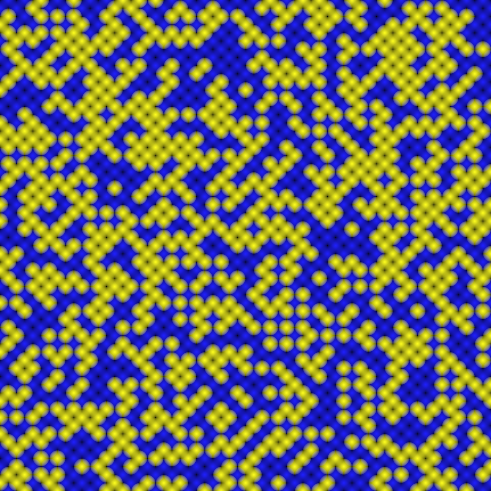

# Wang Tiles Grid generator in

## Goal

Trying to generate a random grid of 2-colored [Wang Tiles](http://www.cr31.co.uk/stagecast/wang/intro.html) based on a single function definition:

```c
RGB wang(BLTR bltr, UV uv);
```

where

- `bltr` is a 4 bit mask encoding the specific Wang Tile. Each bit represents a side of the tile in the following order: Bottom, Left, Top, Right. `0` is the first color, `1` is the second one.
- `uv` is a 2D vector that represents a point on the tile. Top-Left corner is `[0.0, 0.0]`, Bottom-Right corner is `[1.0, 1.0]`. Coordinates are normalized and resolution-independant.
- The result of the function is a 3D vector that represents an RGB color of a pixel on the tile `bltr` at `uv`.

Think of it as a [Fragment Shader](https://www.khronos.org/opengl/wiki/Fragment_Shader) that generates a Texture for a Wang Tile based on its bitmask description.

Here are some Wang Tile Grids we generated so far:



## Quick Start

The project is using [nobuild](https://github.com/tsoding/nobuild) build system.

```console
$ cc -o nobuild nobuild.c
$ ./nobuild run
$ feh atlas.png
$ feh grid.png
```
